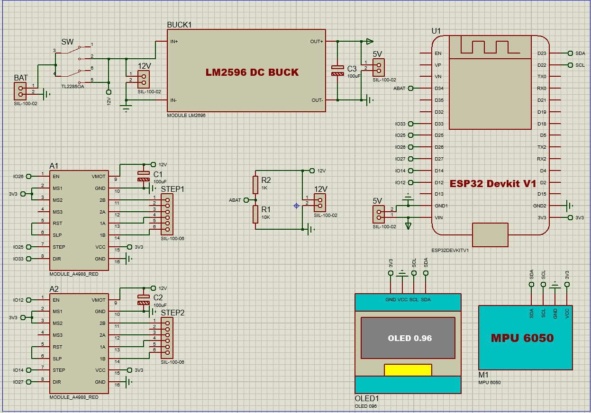

# 🚀 Self-Balancing Robot Project

## 📖 Introduction
This project is about building a **self-balancing robot car** using an **ESP32**, **stepper motors**, **A4988 drivers**, and an **MPU6050 sensor**.  
The goal is to apply knowledge of:
- Stepper motor control
- IMU data filtering (MPU6050)
- PID control
- IoT and wireless communication (Bluetooth/WiFi)

---

## 🛠️ Hardware Components
- ESP32 (DevKit v1)
- 2x Stepper motors (42mm NEMA17 or equivalent)
- 2x A4988 motor drivers
- MPU6050 Gyroscope + Accelerometer sensor
- Li-ion 18650 battery pack 
- 3D printed / mechanical chassis
- Supporting components: switch, capacitors, jumper wires...

---

## ⚙️ How It Works
1. The **MPU6050 sensor** reads acceleration and gyroscope data to calculate the tilt angle.  
2. A **filter algorithm (Complementary/Kalman filter)** smooths the raw data.  
3. A **PID controller** computes correction signals based on the tilt angle.  
4. The **ESP32** generates control pulses to the A4988 drivers → rotates the stepper motors.  
5. The robot moves forward/backward to maintain balance.  

---

## 📐 Block Schematic

